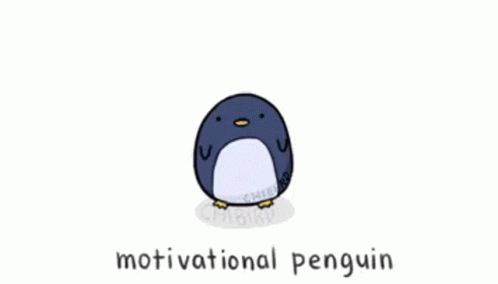

# Cédric - 38 ans - Développeur Junior chez BeCode

## Qui est Cédric ?
Cédric, appelé plus couramment Cééééd avec beaucoup de "é" est un homme de 38 ans vivant avec sa compagne et ses deux enfants à Chièvres, à côté de Ath.  

Passionné par le développement personnel, il ne manque jamais une occasion d'apprendre. Il dispose d'un parcours professionnel assez atypique, mais qui lui ont permi de mettre un grand nombre de cordes à son arc : Manager chez Sibelga et Belfius, Technicien chez Ores, Policier, et même commercial chez Ixina.  

Son parcours en développement personnel, l'a également amené à faire une conférence sur les habitudes quotidiennes gagnantes lui ont permis d'animer une conférence devant une trentaine de chef d'entreprise, auprès du Centre des Jeunes Dirigeants du Périgord.  

**Un petit mantra pour conclure cette partie :**
> *On vise l'excellence en prenant du plaisir à ce qu'on fait ; ainsi, on peut tout réussir !*

## 3 skills surprenantes
- ### Créer du lien et trouver des solutions "Out of the box"  
Globalement, compte tenu les nombreuses expériences acquises dans le milieu professionnel et extraprofessionnel, j'ai cette tendance assez rapide à faire des liens entre toutes les connaissances acquises afin de trouver des solutions auxquelles on ne pense pas forcément et instinctivement.  

***Exemple** : lorsque je travaillais chez Ixina, j'ai vite compris que le programme que nous utilisions n'était pas uniquement destiné à faire des cuisines. De là, lorque j'en ai eu l'opportunité, j'ai créé une cuisine, une salle à manger complète, une bibliothèque et des meubles de salons. Résultat : un montant de 34.000 euros pour le client, là où le prix moyen d'une cuisine était de 7.000 euros à l'époque.*

- ### Développement personnel  
Je m'intéresse depuis plusieurs années maintenant au développement de mes compétences, et notamment de mon bien-être à la fois mental et physique. Pour ce faire, je m'adonne à une pratique quotidienne rigoureuse : le Miracle Morning. En quelque mots, cela consiste à executer tous les matins le rituel suivant :
1. **Exercise physique** : course à pied et renforcement musculaire
2. **Méditation** : 10 minutes de méditation guidée
3. **Affirmation** : affirmer chaque matin notre désir d'obtenir certains résultats permet de transformer ces idées en leur équivalent matériel / physique
4. **Visualisation** : prendre le temps de visualiser à court, moyen et long terme ce que l'on souhaite accomplir, afin d'avoir toujours notre boussole à portée de main, et d'envisager les difficultés ainsi que les solutions
5. **Lecture** : d'un ouvrage qui permette d'apprendre quelque chose ; l'objectif est d'en tirer une idée, de se l'approprier et de la mettre en application dans la journée/semaine
6. **Ecriture** : que ce soit par la tenue d'un journal ou la rédaction d'article de blog, il faut susciter la créativité, et rien de tel que l'écriture pour le faire  

Ce n'est que lorsque j'ai terminé cela, que ma journée de travail / d'étude, peut réellement commencer, mais dans un état dynamisant. Pour plus d'informations relatives au Miracle Morning, je vous invite à lire les articles que j'ai rédigés dans la partie **[Blog](https://cedrictruyen.com/blog)** de mon site web.  

**La ptite info en plus**  
En 2021, mon premier site web sur le développement personnel a attiré l'attention du CJD Périgord (Centre des Jeunes Dirigeants). Ceux-ci m'ont dès lors demandé de faire une conférence sur le Miracle Morning devant une 30aine de chefs d'entreprise. **Défi accepté pour une expérience inoubliable !**

- ### Poker  
Pas grand chose de plus à ajouter sur cet élément, si ce n'est que j'aime particulièrement les jeux de stratégie, dont le poker. J'ai donc décidé il y a quelques années de me former sérieusement, ce qui me permet aujourd'hui d'être un joueur gagnant sur les limites dans lesquelles je joue (ABI5).

## Ces 3 choses que j'aime le plus dans l'univers
- ### Ma famille
J'ai une compagne extraordinaire depuis bientôt 16 ans, et deux enfants géniaux. Je ne profite malheureusement pas suffisamment d'eux, mais je sais qu'ils sont un moteur immense pour moi. Je n'ai pas besoin de m'épancher plus sur le sujet.

- ### Apprendre
La connaissance est partout : que ce soit dans les livres, sur internet, dans les écoles, dans les relations avec les autres. En tant qu'être humain, nous avons cette faculté de pouvoir faire quelque chose de ce que nous apprenons. La connaissance et ce que nous en faisons donne un pouvoir immense. Et c'est pourquoi je considère la connaissance, sous toutes ses formes et dans tous les domaines, comme une magnificence dans l'univers.  

- ### L'argent  
Je fais clairement partie de ces personnes qui peuvent sacrifier un grand nombre de choses pour l'argent, pour gagner plus. Et pour cela, j'investis. Je considère que celui qui dit "l'argent le fait pas le bonheur" n'a jamais connu la pauvreté et ce qu'elle entraine.
On peut dire ce que l'on veut, mais on est quand même plus heureux :    
   - Quand on a les moyens d'offrir des stages pendant l'été à ses enfants
   - Quand on peut voyager et leur montrer toutes les merveilles du monde
   - Quand on peut s'offrir un bon restaurant une fois par semaine
   - Quand on n'a pas à regarder à deux fois avant de se faire plaisir !  

Et de mon point de vue, ne pas le reconnaitre est hypocrite !

## Mes objectifs
- ### Chez BeCode : être full stack dans 7 mois
Globalement, je souhaite me mettre systématiquement en difficulté, afin de créer les bons mécanismes qui me permettront d'être autonome dans 7 mois.

Toutefois, après 3 jours déjà chez Becode, je me rends compte que le chemin sera très long et semé d'embuches. Et on a très peu de temps pour y arriver. Mais je suis déjà tellement satisfait de voir ce que je suis déjà capable de réaliser, après si peu de temps.

- ### Full Stack, oui mais...
La partie principale sur laquelle je veux réellement me concentrer, c'est le front end. En effet, ce qui est important pour moi, c'est le rendu final, ce que l'utilisateur voir.
J'ai besoin de voir rapidement le résutlat concret de mon travail, tel un utilisateur lambda.
Et c'est évidemment raccord avec mon objectif Nice To Have d'après BeCode.

- ### Après BeCode : le Nice To Have  
Je souhaite ouvrir mon agence de communication. Ce serait réellement idéal pour moi de me lancer immédiatement en Freelance, et proposer deux types de services :
1. La création de solutions web et mobile pour entreprises et particuliers
2. La consultance et le conseil en communication dans les entreprises (Coaching Agile)

Je vais tout faire pour être capable de me lancer immédiatement. Toutefois, si cela n'est pas possible, je me dirige vers le plan B.

- ### Après BeCode : le plan B
Je ne considère pas cela réellement comme un plan B, mais plutôt comme le minimum acceptable après cette formation : avoir trouvé un travail en tant que développeur Full Stack, afin :
1. D'une part de parfaire mes connaissances, le temps d'être réellement prêt
2. D'autre part de créer mon entreprise sur le côté, et donc de travailler sur les deux tableaux.  

## Les peurs que je peux avoir
Je ne vais pas rentrer dans les détails, je vais uniquement énumérer les différentes peurs que j'ai par ordre d'importance :
 - Ne pas être prêt à la fin de la formation
 - Avoir les bons réflexes en cas de problèmes
 - Planter mon ordinateur / Ne pas avoir bien réalisé certaines tâches
 - Peur d'abandonner
 - Peur de m'éparpiller
 - Peur de décevoir

## Les choses que j'attends avec impatience

 - Créer notre premier projet de site web
 - Créer un très gros projet en équipe, pourquoi pas à la demande d'une entreprise ?

Pour le reste, j'attends chaque jour le jour suivant pour avoir une nouvelle journée d'appretissage à BeCode, et vivre cette formation au jour le jour !

## Les 3 choses que je considère comme les plus importantes afin de travailler en équipe
Selon moi, et mon expérience, voici trois éléments indispensables afin d'être le plus efficient lorsque l'on travaille en équipe :
 1. La mentalité Agile : on s'adapte !
 2. La communication : pas de malentendus -communication positive et négative + remise en question
 3. L'extra mile : la volonté de faire plus que ce que l'on attend de nous, avec rigueur. On recherche l'excellence, mais en prenant du plaisir à ce qu'on fait.
   

### Et pour terminer, un Gif de motivatiton

